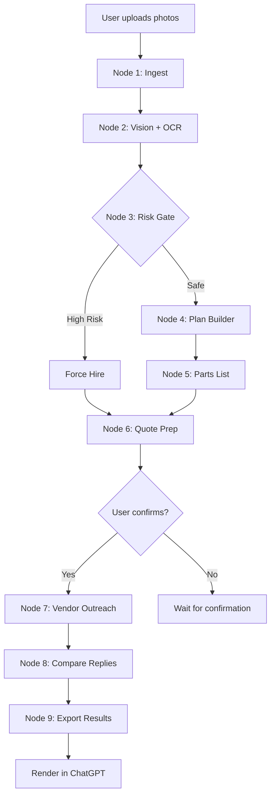

# AgentKit Workflow Architecture

This document explains the multi-step agent workflow that powers the Home Repair Diagnosis app.

## Overview

AgentKit orchestrates the behind-the-scenes logic across multiple nodes, each handling a specific step in the diagnosis pipeline. The workflow is **auditable**, **interruptible**, and includes **safety gates**.

## Workflow Nodes

```
┌─────────────────────────────────────────────────────────────────┐
│                      AGENTKIT PIPELINE                           │
└─────────────────────────────────────────────────────────────────┘

1. INGEST
   ↓ (Photos + Description)
   
2. VISION + OCR
   ↓ (Visual analysis via GPT-4o)
   
3. RISK GATE ⚠️
   ↓ (Safety check: gas/electrical/structural?)
   │
   ├─ HIGH RISK → Force "Hire" → Skip to node 6
   │
   └─ LOW/MEDIUM → Continue
      ↓
      
4. PLAN BUILDER
   ↓ (Generate step-by-step instructions)
   
5. PARTS LIST
   ↓ (BOM with price ranges)
   
6. QUOTE REQUEST PREP
   ↓ (User confirmation required)
   
7. VENDOR OUTREACH
   ↓ (Contact contractors via APIs)
   
8. COMPARE REPLIES
   ↓ (Rank by rating, price, availability)
   
9. EXPORT
   └─ (Deliver results to user)
```

## Node Details

### Node 1: Ingest

**Purpose**: Receive and validate user input

**Input**:
- 1-5 photos (JPEG/PNG/WebP, max 5MB each)
- Description (10-500 characters)

**Processing**:
- File type validation
- Size limit enforcement
- Sanitize description (remove HTML/scripts)
- Convert photos to base64

**Output**:
```json
{
  "photos": ["data:image/jpeg;base64,..."],
  "description": "Sanitized text"
}
```

**Error handling**:
- Invalid file type → Reject
- Over size limit → Reject
- No photos → Reject

---

### Node 2: Vision + OCR

**Purpose**: Analyze photos using GPT-4o Vision API

**Input**: Sanitized photos + description

**Processing**:
- Call OpenAI Vision API
- Extract text from images (OCR)
- Identify issue type
- Assess visible damage
- Detect safety hazards

**Prompt strategy**:
```
System: You are a home repair expert. Identify:
1. Exact issue type
2. Risk level (low/medium/high/critical)
3. Visible safety concerns
4. Confidence in diagnosis (0-100%)

Be conservative: when in doubt, recommend professional help.
```

**Output**:
```json
{
  "issue_type": "Leaking kitchen faucet",
  "risk_level": "low",
  "confidence": 85,
  "safety_concerns": ["Water damage to cabinet"],
  "raw_analysis": "Full GPT response..."
}
```

**Error handling**:
- API timeout → Retry (3x)
- Invalid response → Fallback to "unknown issue"
- Rate limit → Queue request

---

### Node 3: Risk Gate ⚠️

**Purpose**: Hard stop for dangerous repairs

**Input**: Analysis from node 2

**Processing**:
```javascript
// Keyword matching
const HIGH_RISK = [
  'gas', 'natural gas', 'propane',
  'electrical panel', 'breaker box',
  'roof', 'structural', 'foundation',
  'asbestos', 'mold'
];

if (text.includes(HIGH_RISK)) {
  return { force_hire: true, reason: '...' };
}
```

**Decision tree**:
```
Is high-risk keyword detected?
├─ YES → Force "Hire Professional"
│         ├─ Disable DIY actions
│         ├─ Show safety warning
│         └─ Jump to node 6 (quotes)
│
└─ NO → Continue to node 4 (plan builder)
```

**Output**:
```json
{
  "gate_triggered": true/false,
  "recommendation": "diy" | "hire",
  "force_hire": true/false,
  "reason": "Detected gas line - requires licensed plumber"
}
```

**Safety guarantees**:
- ✅ No override possible (user can't bypass)
- ✅ Logged for audit
- ✅ Conservative matching (false positives OK)

---

### Node 4: Plan Builder

**Purpose**: Generate step-by-step repair instructions

**Input**: Issue type + risk level

**Processing**:
- Call GPT-4o with structured prompt
- Request JSON output (5-10 steps)
- Include safety notes per step
- Estimate time per step
- List required tools/parts

**Prompt strategy**:
```
Create a beginner-friendly repair plan for: [issue_type]

Requirements:
- 5-10 clear steps
- Each step: title, description, duration, safety note
- Total time estimate
- Difficulty level: Beginner/Intermediate/Advanced
```

**Output**:
```json
{
  "steps": [
    {
      "step_number": 1,
      "title": "Shut off water",
      "description": "...",
      "duration_minutes": 5,
      "safety_note": "Keep towels ready",
      "tools_needed": [],
      "parts_needed": []
    }
  ],
  "total_time_minutes": 50,
  "difficulty": "Beginner"
}
```

**Edge cases**:
- High-risk bypass → Return "contact professional" plan
- Vague issue type → Request more info
- Complex repair → Increase difficulty rating

---

### Node 5: Parts List (BOM)

**Purpose**: Generate bill of materials with price ranges

**Input**: Issue type

**Processing**:
- Call GPT-4o for parts/tools list
- Research current retail prices
- Separate parts (consumable) vs tools (reusable)
- Flag optional items
- Calculate total cost range

**Prompt strategy**:
```
Create a shopping list for: [issue_type]

Include:
- All parts needed (with specs)
- All tools needed
- Quantity for each
- Price range (min-max USD)
- Optional vs required
- Notes (alternatives, sizes)
```

**Output**:
```json
{
  "parts": [
    {
      "name": "Faucet repair kit",
      "quantity": 1,
      "price_min": 8.99,
      "price_max": 15.99,
      "optional": false,
      "notes": "Universal fit"
    }
  ],
  "tools": [...],
  "total_cost_min": 47.97,
  "total_cost_max": 111.97
}
```

**Price accuracy**:
- Based on Home Depot, Lowe's, Amazon (2024 prices)
- Updated quarterly via prompt tuning
- Ranges account for quality tiers

---

### Node 6: Quote Request Prep

**Purpose**: Prepare contractor outreach (with confirmation)

**Input**: Issue type, risk level, user ZIP code

**Processing**:
- Validate ZIP code format
- Generate work scope summary
- Estimate project size (small/medium/large)
- **Require explicit user confirmation**

**Confirmation flow**:
```
1. Show preview: "We'll share this info with contractors:"
   - ZIP code (not full address)
   - Work scope
   - Estimated size
   
2. User clicks "Confirm" → confirmed: true

3. Without confirmation → Block request
```

**Output**:
```json
{
  "zip_code": "90210",
  "work_scope": "Replace leaking kitchen faucet...",
  "project_size": "small",
  "confirmed": true,
  "timestamp": "2024-01-15T12:00:00Z"
}
```

**Privacy**:
- ✅ No full address shared
- ✅ No phone/email at this stage
- ✅ User controls what's shared

---

### Node 7: Vendor Outreach

**Purpose**: Contact contractors via third-party APIs

**APIs to integrate** (production):
- HomeAdvisor API
- Thumbtack Pro API
- Angi (Angie's List) API

**Current implementation** (MVP):
- Mock contractor data
- Simulates API response

**Future implementation**:
```javascript
const contractors = await homeAdvisor.requestQuotes({
  zip: '90210',
  category: 'plumbing',
  scope: 'Faucet repair',
  timeline: 'within_week'
});
```

**Output**:
```json
{
  "contractors": [
    {
      "name": "ABC Plumbing",
      "rating": 4.8,
      "review_count": 234,
      "licensed": true,
      "insured": true,
      "distance_miles": 3.2,
      "typical_response_time": "2-4 hours"
    }
  ],
  "quote_count": 3
}
```

---

### Node 8: Compare Replies

**Purpose**: Rank contractors by quality

**Ranking factors**:
1. **Rating** (40% weight)
2. **Review count** (20%)
3. **Distance** (15%)
4. **Response time** (15%)
5. **Years in business** (10%)

**Algorithm**:
```javascript
score = (rating / 5) * 40 +
        (Math.min(reviewCount, 500) / 500) * 20 +
        (1 / (1 + distance)) * 15 +
        (responseSpeed) * 15 +
        (Math.min(yearsInBusiness, 20) / 20) * 10;
```

**Filters applied**:
- ✅ Must be licensed
- ✅ Must be insured
- ✅ Within 25 miles
- ✅ Active in last 30 days

**Output**:
```json
{
  "recommended": [
    { "contractor": {...}, "score": 92 },
    { "contractor": {...}, "score": 88 },
    { "contractor": {...}, "score": 85 }
  ],
  "total_available": 12,
  "filtered_out": 9
}
```

---

### Node 9: Export

**Purpose**: Deliver results to user

**Export formats**:
1. **Inline cards** (default)
   - Issue Summary
   - Parts & Tools
   
2. **Fullscreen** (on demand)
   - Step-by-step plan
   
3. **Downloadable** (optional)
   - PDF: Complete repair guide
   - CSV: Shopping list
   - JSON: Raw data

**Delivery**:
```javascript
// Apps SDK renders cards in ChatGPT
window.openai.renderCard('IssueSummary', diagnosisData);
window.openai.renderCard('PartsAndTools', bomData);

// Fullscreen on user request
window.openai.openFullscreen('StepsView', planData);
```

---

## Error Handling

Each node implements:

1. **Retry logic**: 3 attempts with exponential backoff
2. **Fallback**: Graceful degradation (e.g., "Unable to generate plan, please describe issue differently")
3. **Logging**: All errors logged with context (node, input, error)
4. **User messaging**: Friendly error messages (no stack traces)

Example:
```javascript
try {
  const result = await node2_vision(input);
} catch (error) {
  logger.error('Node 2 failed', { error, input });
  
  if (error.code === 'rate_limit') {
    return { error: 'Too many requests, try again in 1 minute' };
  }
  
  return { error: 'Unable to analyze photos, please try different images' };
}
```

---

## Workflow Visualization



---

## Audit Trail

Every workflow execution is logged:

```json
{
  "workflow_id": "uuid-1234",
  "timestamp": "2024-01-15T12:00:00Z",
  "nodes_executed": [1, 2, 3, 4, 5, 9],
  "nodes_skipped": [6, 7, 8],
  "skip_reason": "DIY recommended - no quotes needed",
  "total_duration_ms": 3450,
  "user_id": "[REDACTED]",
  "result": "success"
}
```

**Retention**: 30 days for debugging, then purged.

---

## Future Enhancements

1. **Node 2a: Multi-photo correlation**
   - Compare multiple angles
   - Detect inconsistencies
   - Build 3D model (if enough photos)

2. **Node 3a: Code compliance check**
   - Query local building codes by ZIP
   - Flag permit requirements
   - Warn about HOA restrictions

3. **Node 4a: Video tutorials**
   - Link to YouTube guides
   - Generate custom video (future)

4. **Node 5a: Price tracking**
   - Real-time API integration (Home Depot, etc.)
   - Price drop alerts
   - Coupon matching

5. **Node 10: Follow-up**
   - Check in 7 days post-repair
   - Collect feedback
   - Offer warranty registration

---

**Questions?** See [SETUP.md](./SETUP.md) for testing individual nodes.
